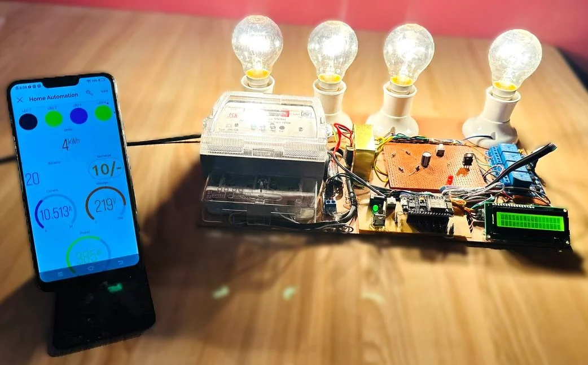

# 🏠 IoT-Based Home Automation System Using NodeMCU and Blynk



## 📌 Project Overview

The IoT-Based Home Automation System is a smart home solution that enables users to remotely control household appliances through a smartphone using internet connectivity. The system is built using the NodeMCU ESP8266 microcontroller and the Blynk IoT platform.

Users can switch appliances ON or OFF from anywhere using the Blynk mobile application. The system also incorporates an LCD display for status monitoring and an energy monitoring section to observe power consumption in real time.

This project demonstrates the practical implementation of Internet of Things (IoT) technology in modern smart homes while improving convenience, energy efficiency, and automation.

---

## 🎯 Problem Statement

Traditional home electrical systems require manual operation of appliances. Users often forget to switch off devices, resulting in unnecessary power consumption and increased electricity bills.

Additionally, elderly and physically challenged individuals may find it difficult to operate household appliances manually.

This project addresses these challenges by providing a reliable internet-enabled system capable of remotely controlling appliances through a smartphone application.

---

## 🎯 Objectives

* Develop an IoT-based home automation system
* Enable remote appliance control through smartphones
* Improve energy efficiency
* Reduce manual intervention
* Demonstrate practical IoT implementation
* Provide real-time appliance monitoring
* Create a scalable and cost-effective smart home solution

---

## 🚀 Features

* 📱 Smartphone-based appliance control
* 🌐 Wi-Fi connectivity
* ☁️ Cloud communication using Blynk
* ⚡ Real-time relay switching
* 💡 Control of multiple appliances
* 📊 Energy consumption monitoring
* 🖥 LCD status display
* 🔄 Real-time response
* 🏡 Smart home integration

---

## 🛠 Hardware Components

| Component                 | Quantity    |
| ------------------------- | ----------- |
| NodeMCU ESP8266           | 1           |
| 4-Channel Relay Module    | 1           |
| AC Bulbs                  | 4           |
| Bulb Holders              | 4           |
| LCD Display (16x2)        | 1           |
| Energy Meter              | 1           |
| Transformer               | 1           |
| Voltage Regulator Circuit | 1           |
| Capacitors & Diodes       | As Required |
| Push Buttons              | As Required |
| Jumper Wires              | As Required |

---

## 💻 Software & Technologies Used

### Technologies

* NodeMCU ESP8266
* Arduino IDE
* Blynk IoT Platform
* Embedded C/C++
* Wi-Fi Communication
* Cloud-Based Control

### Libraries Used

* ESP8266WiFi.h
* BlynkSimpleEsp8266.h
* LiquidCrystal.h
* EEPROM.h
* BlynkTimer.h

---

## 🏗 System Architecture

```text
Smartphone
     │
     ▼
 Blynk Cloud
     │
     ▼
 NodeMCU ESP8266
     │
     ▼
 Relay Module
     │
     ▼
 Home Appliances
```

---

## 📸 Hardware Setup

The complete hardware prototype consists of:

* NodeMCU ESP8266
* 4-channel relay module
* LCD display
* Energy monitoring unit
* AC bulbs used as appliance loads
* Mobile application dashboard


---

## ⚙ Working Principle

### Step 1

The NodeMCU ESP8266 connects to the Wi-Fi network.

### Step 2

The NodeMCU establishes communication with the Blynk cloud server.

### Step 3

The user sends commands through the Blynk mobile application.

### Step 4

The Blynk cloud forwards the command to the NodeMCU.

### Step 5

The NodeMCU processes the received command.

### Step 6

The corresponding relay channel is activated.

### Step 7

The connected appliance switches ON or OFF.

### Step 8

The LCD display updates the current appliance status.

---

## 📊 Results

The developed prototype successfully demonstrated:

* Remote control of four AC bulbs
* Stable Wi-Fi communication
* Real-time appliance control
* Reliable relay switching
* LCD-based status monitoring
* Energy consumption monitoring

### Performance

* Response Time: Less than 2 seconds
* Stable operation during continuous testing
* User-friendly mobile interface

---

## 🌍 Applications

* Smart Homes
* Smart Offices
* Hotels
* Hospitals
* Educational Institutions
* Industrial Automation
* Energy Management Systems

---

## ✅ Advantages

* Low-cost implementation
* Easy installation
* Remote accessibility
* Energy efficient
* User-friendly operation
* Scalable architecture
* Reliable wireless communication

---

## ⚠ Limitations

* Requires internet connectivity
* Dependent on Wi-Fi availability
* Basic security implementation
* Limited appliance feedback

---

## 🔮 Future Enhancements

* Voice Control using Alexa
* Google Assistant Integration
* AI-Based Automation
* Motion Detection
* Smart Security Features
* Energy Consumption Analytics
* Mobile Notifications
* Sensor-Based Automation

---

## 📂 Repository Structure

```text
Home-Automation-System-Using-IoT/
│
├── Code/
│   └── HomeAutomationCode.c
│
├── Documentation/
│   ├── Components_List.pdf
│   └── Project_Report.pdf
│
├── Images/
│   └── Hardware_Setup.jpg
│
├── Libraries/
│
└── README.md
```

---

## 👨‍💻 Author

**Rohit Arya**

Electronics & Communication Engineering (ECE)

Interests:

* IoT Systems
* Embedded Systems
* Smart Automation
* Robotics
* Defense Technology
* Python Development

---

## ⭐ If you found this project useful, consider giving it a star!
